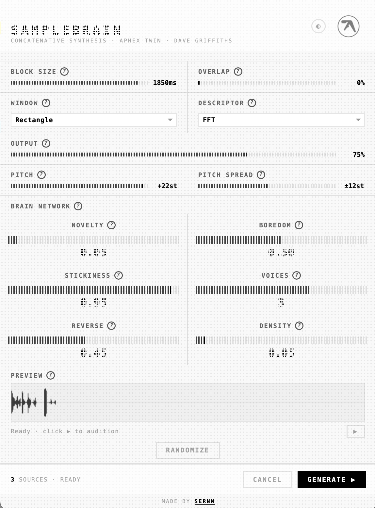
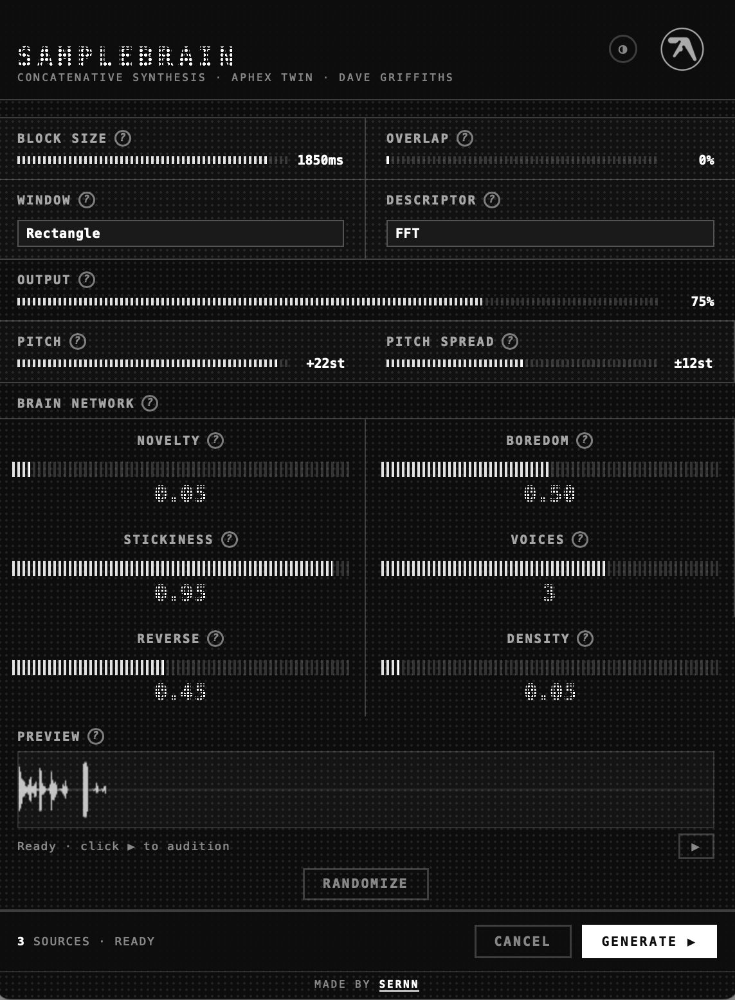
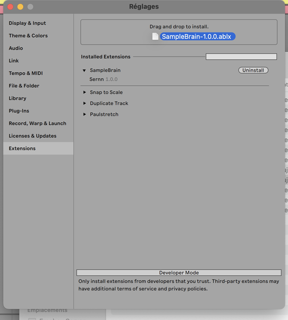
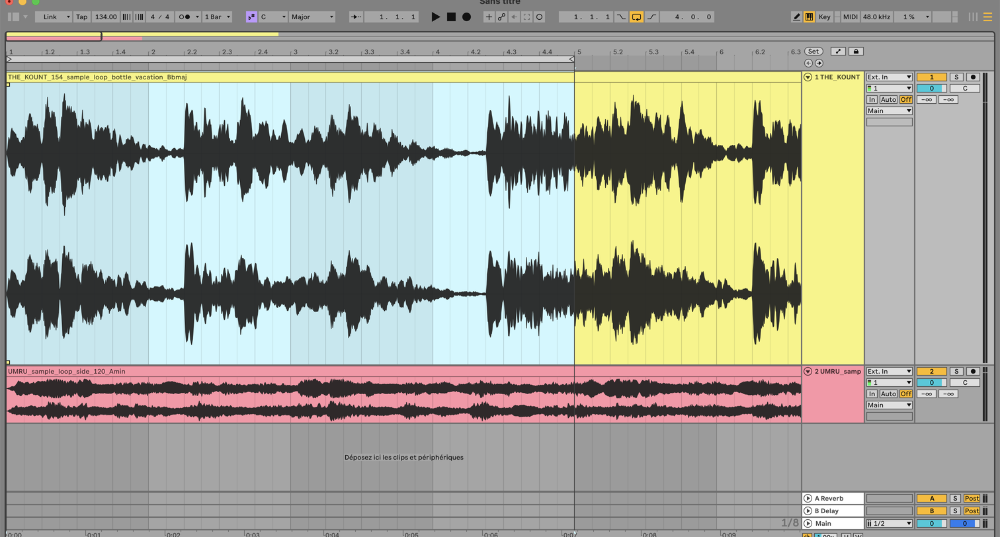
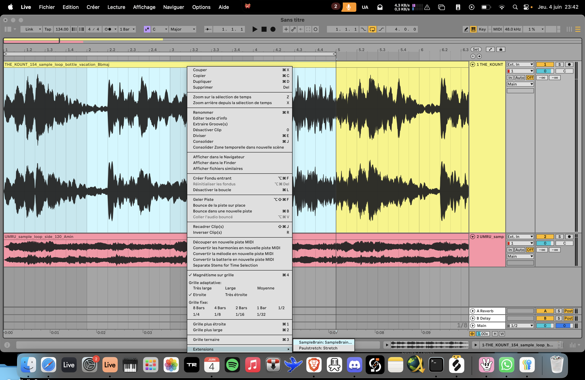
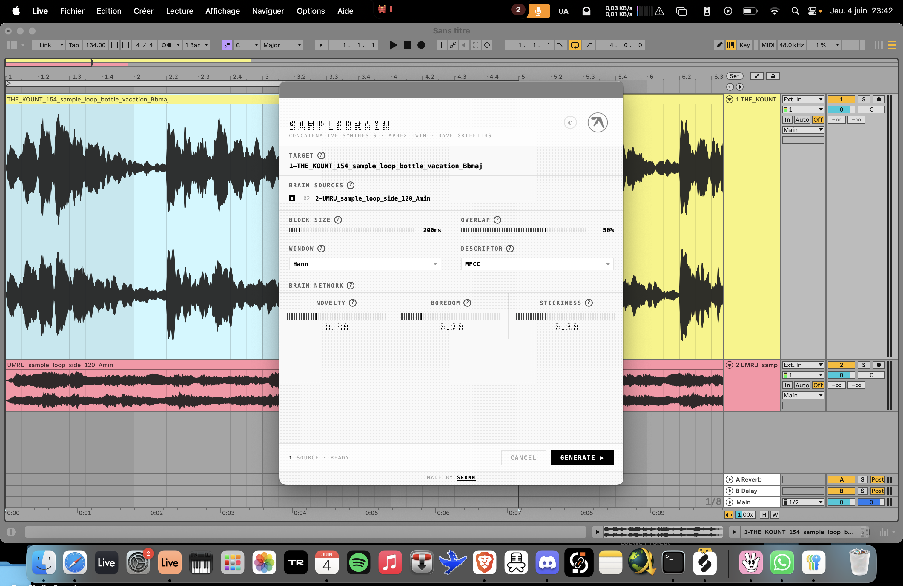
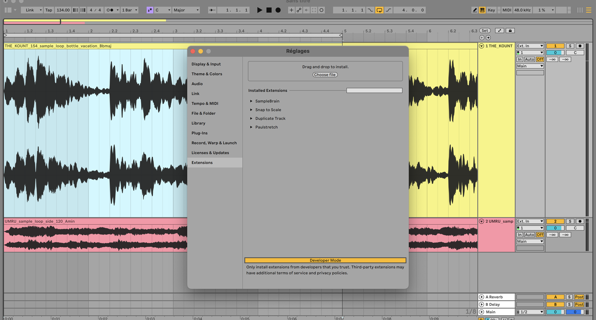

# SampleBrain — Ableton Live Extension

> Concatenative synthesis inside Ableton Live 12, inspired by [SampleBrain](https://gitlab.com/then-try-this/samplebrain) by Dave Griffiths & Aphex Twin.

**Made by [Sernn](https://linktr.ee/sernn)**




---

## What it does

SampleBrain chops your **brain tracks** (audio corpus) into small grains, analyses each grain spectrally (MFCC or FFT), then reconstructs the **target track** selection by finding the closest-matching grain for each time slice. The result is placed on a new audio track.

```
Target (spectral shape) + Brain (sound material) → new audio clip
```

---

## Install (no dev tools needed)

> Requires **Ableton Live 12 Beta**, Suite edition.

1. Download `SampleBrain-1.1.0.ablx` from [Releases](../../releases)
2. In Live: **Preferences → Extensions**
3. Drag & drop the `.ablx` file onto the panel



4. Make sure **Developer Mode is OFF** in Live's preferences
5. Right-click any audio track arrangement selection → **SampleBrain…**

> **Note:** if the extension doesn't appear after install, try disabling other extensions temporarily — Live 12 Beta has a known bug where loading many extensions at once can break the catalog.

---

## How to use

**Step 1 — Select a time range** on an audio track in the Arrangement View (click + drag)



**Step 2 — Right-click → Extensions → SampleBrain…**



**Step 3 — Configure and Generate** — check at least one brain source, adjust parameters, click **Generate ▶**



A new track `SB: <target name>` appears with the result.

### Parameters

| Parameter | Description |
|---|---|
| **Block size** | Grain size in ms. Small = granular. Large = smooth/tonal. |
| **Overlap** | OLA crossfade amount. 50% is standard. |
| **Window** | FFT windowing. Hann recommended. |
| **Descriptor** | MFCC = timbre match. FFT = spectral match. Mix = both. |
| **Novelty** | Bias against reusing grains. Higher = more variety. |
| **Boredom** | How fast novelty penalty resets. |
| **Stickiness** | Tendency to follow sequential grains. Higher = longer coherent runs. |

---

## Development setup (SDK step by step)

This section explains how to rebuild the extension from source using the **Ableton Extensions SDK v1.0.0-beta.0**.

### Prerequisites

| Tool | Version | Notes |
|---|---|---|
| Ableton Live 12 Beta | Suite | [ableton.com](https://www.ableton.com) |
| Node.js | ≥ 24.14.1 | [nodejs.org](https://nodejs.org) |
| The Extensions SDK `.zip` | 1.0.0-beta.0 | Distributed by Ableton (Centercode) |

### Step 1 — Enable Developer Mode in Live

Open Live 12 Beta → **Preferences → Extensions** → enable **Developer Mode**.



### Step 2 — Get the SDK

The SDK is distributed by Ableton via Centercode (beta program). The zip contains:

```
extensions-sdk-1/
├── ableton-extensions-sdk-1.0.0-beta.0.tgz
├── ableton-extensions-cli-1.0.0-beta.0.tgz
├── ableton-create-extension-1.0.0-beta.0.tgz
├── docs/
└── examples/
```

Copy the two `.tgz` files into `vendor/`:

```bash
cp path/to/ableton-extensions-sdk-1.0.0-beta.0.tgz vendor/
cp path/to/ableton-extensions-cli-1.0.0-beta.0.tgz vendor/
```

### Step 3 — Install dependencies

```bash
npm install
```

### Step 4 — Configure the Extension Host path

Create a `.env` file at the root of the project:

```bash
# macOS
EXTENSION_HOST_PATH=/Applications/Ableton Live 12 Beta.app/Contents/Helpers/ExtensionHost/ExtensionHostNodeModule.node
```

> **Note:** The `ExtensionHostNodeModule.node` file is only present in the **Beta** build of Live, not in the release version yet.


### Step 5 — Run in development mode

**Important:** Live must be open and fully loaded *before* running `npm start`.

```bash
# 1. Open Ableton Live 12 Beta
# 2. Then:
npm start
```

You should see:

```
Starting Extension Host...
  Extension: /path/to/samplebrain
  Live: /Applications/Ableton Live 12 Beta.app/...

info: #######################################
info: Started: Extension Host 1.0.0
info: #######################################
info: Extension Host sends greeting to Live
info: FlipMessageStreamSocket send success
```

The extension is now live. Right-click on an audio arrangement selection in Live to use it.


### Step 6 — Build for production

```bash
npm run build
```

### Step 7 — Package as `.ablx`

```bash
npm run package
# → SampleBrain-1.0.0.ablx
```

Drag the `.ablx` into **Preferences → Extensions** (Developer Mode OFF) to install it permanently.

---

## Project structure

```
samplebrain/
├── src/
│   ├── extension.ts   # Entry point — context menu, HTTP server, main flow
│   ├── brain.ts       # SampleBrain algorithm — segmentation, kNN, OLA synthesis
│   ├── dsp.ts         # FFT (Cooley-Tukey), MFCC, windowing — pure TS, no deps
│   ├── wav.ts         # WAV + AIFF decode/encode — pure TS, no deps
│   ├── dialog.html    # UI — Ryoji Ikeda-inspired dot-matrix aesthetic
│   └── html.d.ts
├── vendor/            # SDK .tgz files (not on npm)
├── build.ts           # esbuild config
├── manifest.json      # Extension metadata
├── package.json
└── tsconfig.json
```

---

## SDK key concepts

### Execution model

Extensions are **one-shot**: triggered by right-click, run to completion, then stop. No persistent state, no real-time MIDI, no background loops.

```typescript
export function activate(activation: ActivationContext) {
  const ctx = initialize(activation, "1.0.0");
  ctx.ui.registerContextMenuAction("AudioTrack.ArrangementSelection", "SampleBrain…", "cmd.id");
  ctx.commands.registerCommand("cmd.id", async (arg) => { /* ... */ });
}
```

### Rendering audio

```typescript
const wavPath = await ctx.resources.renderPreFxAudio(track, startBeat, endBeat);
// Returns a path to a WAV or AIFF file
```

### Showing a dialog

```typescript
// Serve your HTML over a local HTTP server, then:
const result = await ctx.ui.showModalDialog(`http://127.0.0.1:${port}/`, 576, 648);
// Resolves when the HTML calls close_and_send
```

### Importing & placing a clip

```typescript
const imported = await ctx.resources.importIntoProject(wavPath);
const newTrack = await song.createAudioTrack();
await newTrack.createAudioClip({ filePath: imported, startTime, duration, isWarped: false });
```

### Progress dialog

```typescript
await ctx.ui.withinProgressDialog("Processing…", {}, async (update, signal) => {
  update("Step 1…", 20);
  // ...
  update("Done.", 100);
});
```

---

## License

MIT — do whatever you want with it.

---

*SampleBrain algorithm originally by [Dave Griffiths / then-try-this](https://gitlab.com/then-try-this/samplebrain), developed with Aphex Twin.*
